# Creation of an app service in azure.

## Practice 2

We use a restaurant web page to share it with the azure app service.
We enter the azure portal([azure](https://portal.azure.com/)) search and enter app service
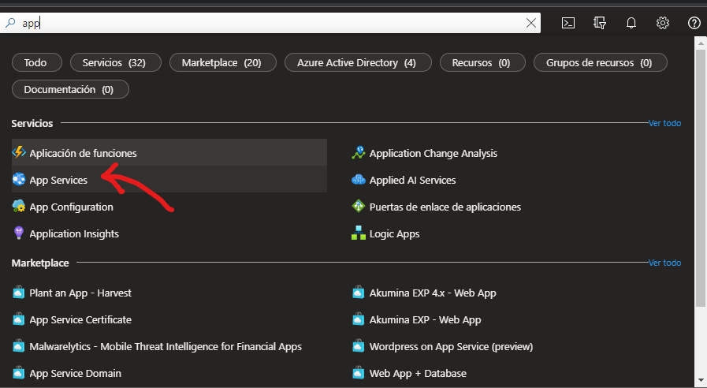

Click on create
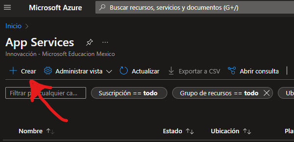

Select the language where we will create the page and region.
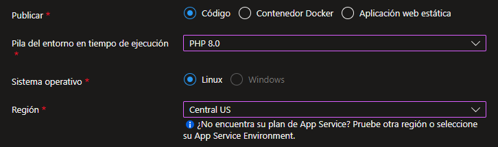
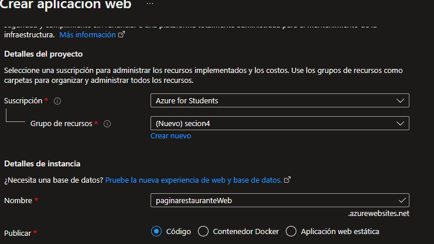

We select F1 to be free, the charge starts at hourly rate.
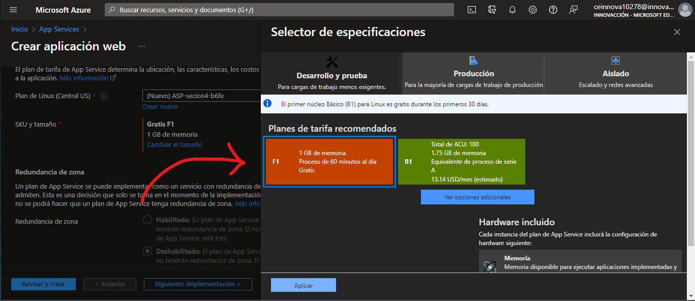

We turn to the resource
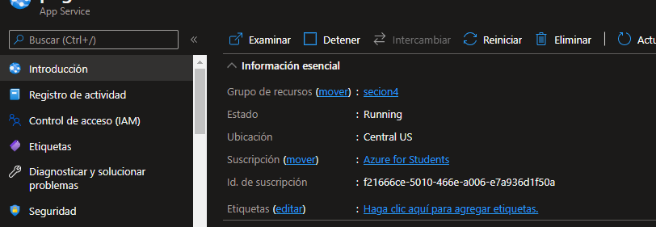

We go to the implementation center to add the page
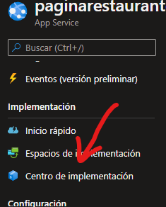

You will have to start the session in github because we will use from github in our case.
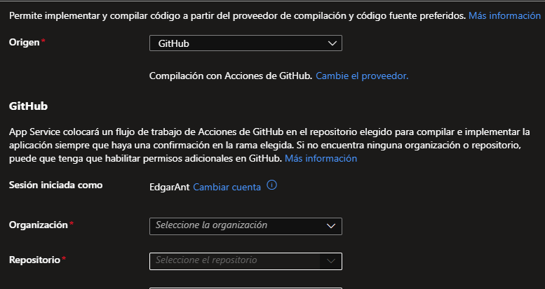

Click 
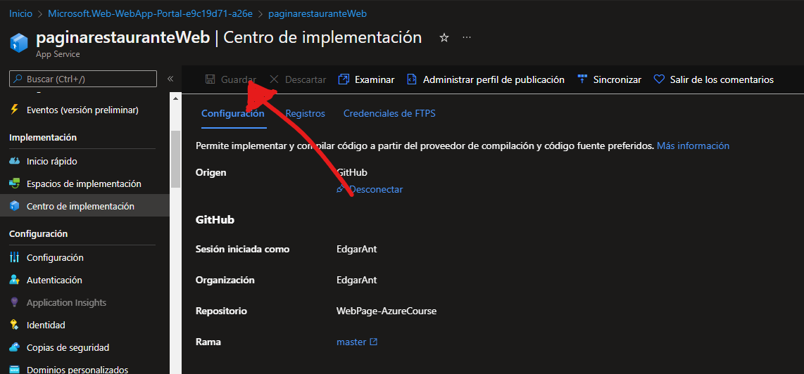

We check that it is implemented in `action` in git hub
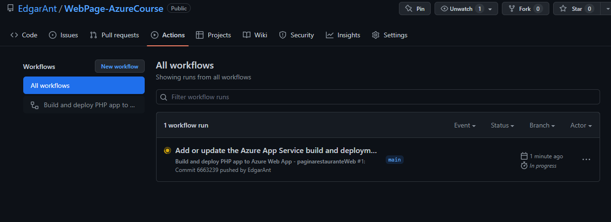
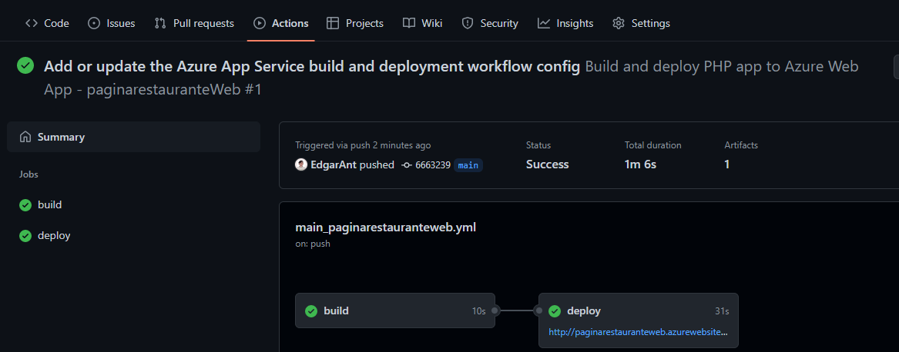
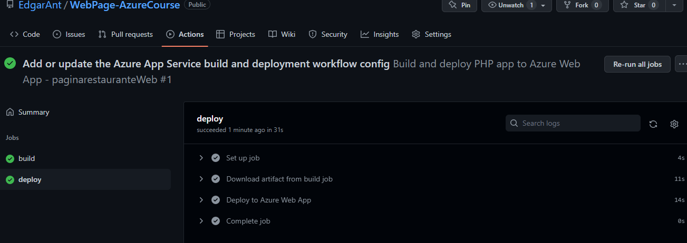

It should now be fully functional
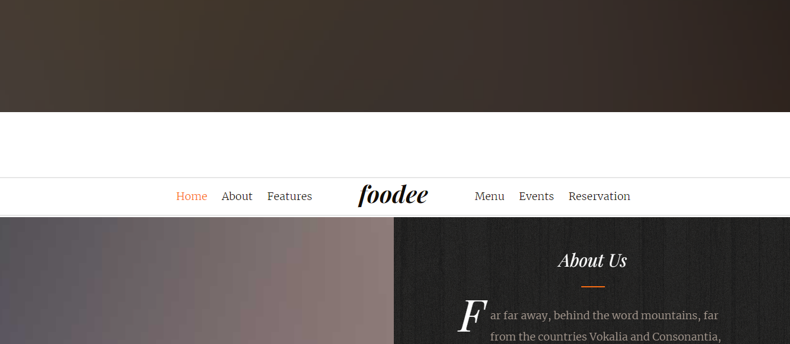

If I want to level up to change domain and more things is here
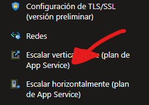

We go to production and select apply
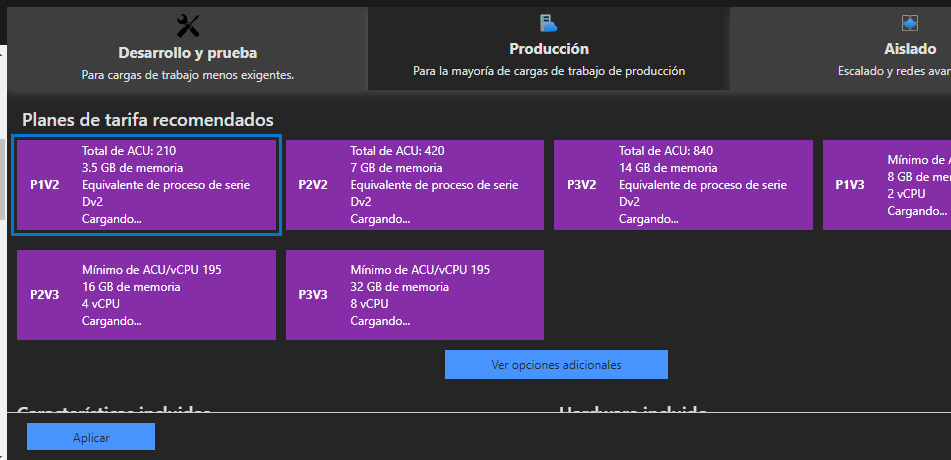

It should now be fully functional and you should be able to display a page from the internet.

